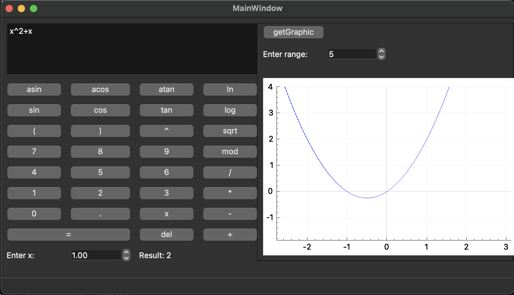

## Implementation of SmartCalc

The SmartCalc program calculates arithmetic expressions in infix notation with integer or double numbers or variable _x_. In order to calculate arithmetic expressions the programm uses reverse Polish notation and Dijkstra's algorithm
Programm supports the following arithmetic operations and mathematical functions:

    - Arithmetic operators:

      | Operator name | Infix notation   (Classic) | Prefix notation   (Polish notation) |  Postfix notation   (Reverse Polish notation) |
      | --------- | ------ | ------ | ------ |
      | Brackets | (a + b) | (+ a b) | a b + |
      | Addition | a + b | + a b | a b + |
      | Subtraction | a - b | - a b | a b - |
      | Multiplication | a * b | * a b | a b * |
      | Division | a / b | / a b | a b \ |
      | Power | a ^ b | ^ a b | a b ^ |
      | Modulus | a mod b | mod a b | a b mod |
      | Unary plus | +a | +a | a+ |
      | Unary minus | -a | -a | a- |

      >Note that the multiplication operator contains the obligatory sign `*`. Processing an expression with the omitted `*` sign is optional and is left to the developer's decision

    - Functions:
  
      | Function description | Function |
      | ------ | ------ |
      | Computes cosine | cos(x) |
      | Computes sine | sin(x) |
      | Computes tangent | tan(x) |
      | Computes arc cosine | acos(x) |
      | Computes arc sine | asin(x) |
      | Computes arc tangent | atan(x) |
      | Computes square root | sqrt(x) |
      | Computes natural logarithm | ln(x) |
      | Computes common logarithm | log(x) |

The programm has GUI implementation, based on QT library

